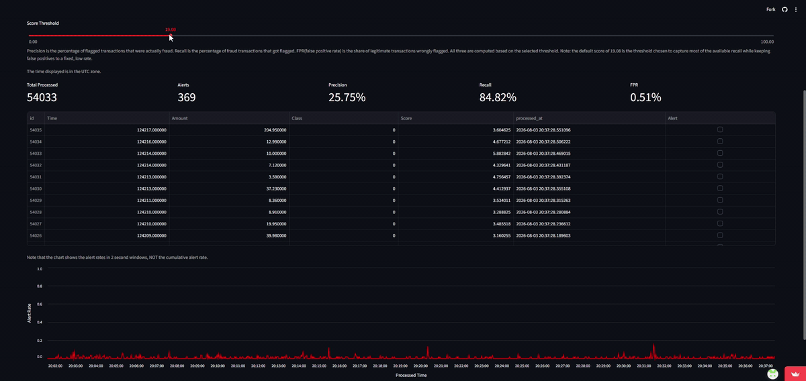
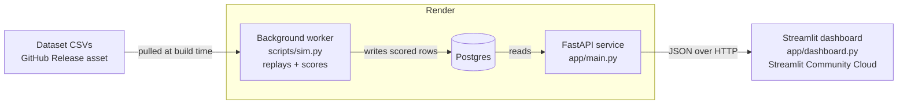

# fraud-detection

Real-time fraud detection system that scores transactions for anomalousness using
hand-implemented statistical methods.

**[▶ Live dashboard](https://fraud-detection-agu.streamlit.app/)** · [API](https://fraud-detection-5awj.onrender.com) · [API docs](https://fraud-detection-5awj.onrender.com/docs)

*The API is hosted on a free-tier web service, so the first load after a period of inactivity may take up to a minute.*



*Transactions scored and landing live. Dragging the threshold recomputes precision,
recall, and false-positive rate, re-flags the table, and reshapes the alert-rate
chart's full history — not just newly arriving rows.*

A stream of credit-card transactions is replayed one at a time against two
statistical baselines: a fixed global model of what "normal" looks like, and an
online model that adapts to how normal shifts over the course of a day. Each
transaction gets an anomaly score; anything scoring above an adjustable threshold
is flagged. The dashboard shows the scores landing live and recomputes precision,
recall, and false-positive rate against the true labels as the threshold moves.
Everything statistical is implemented from scratch.

> **AI Use:** Much of the text (README and markdown cells in notebooks) was written
> with AI assistance. On the other hand, the code is written by me, and I used AI
> mainly to debug/double check my work.

## Architecture



The system runs as four separate deployed pieces. A background worker replays the
held-out transaction stream on a continuous loop, scoring each row and writing it
to Postgres. A FastAPI service is the only thing that reads that database. The
Streamlit dashboard is a pure HTTP client of the API and never touches the database directly.

Making the replay an always-on worker rather than a thread inside
the web service keeps the stream running independently of the web service's
lifecycle and keeps the API stateless. The worker clears and repopulates the table
on each pass, so the live demo always shows a stream in progress rather than a
static finished dataset.

## Results

Evaluated on the held-out streaming split (~85K transactions, ~0.17% fraud):

| Metric | Value |
| --- | --- |
| ROC-AUC | 0.959 |
| PR-AUC | 0.564 |
| Recall @ 0.5% FPR | 81.8% |
| Precision @ 0.5% FPR | 22.1% |
| Selected threshold | 19.08 |

The detector catches roughly four in five fraudulent transactions while flagging
one in every two hundred legitimate ones. Precision is low by design rather than
by failure: with fraud at ~0.17% of volume, false positives are drawn from a pool
over 500 times larger than the pool of real fraud, so even a very low false-positive
*rate* produces a large false-positive *count*.

See [Approach](#approach) below for how the threshold was chosen — including why
these figures are likely somewhat optimistic, since the threshold was selected on
the same split the metrics are reported on rather than a separate held-out set.

## Approach

**Dataset:** Kaggle "Credit Card Fraud Detection" (ULB) — ~285,000 transactions,
~0.17% fraud. Features are `Time`, `Amount`, and PCA-anonymized `V1`-`V28`. Split
into a historical set (baseline statistics) and a streaming set (held-out, replayed
as if live).

**Layer 1 — Global baseline (Mahalanobis distance).** Fit a mean vector and
covariance matrix on non-fraud historical transactions. Score each new transaction
by its Mahalanobis distance, D² = (x-μ)ᵀΣ⁻¹(x-μ), computed via Cholesky
factorization rather than direct matrix inversion. Higher distance = more
anomalous.

**Layer 2 — Time-adaptive baseline (EWMA).** This dataset is PCA-anonymized with
no real user/account IDs, so true per-entity baselines aren't possible. Rather
than fabricate synthetic entities, this layer instead adapts to time-based variance, 
which was empirically validated before building it: transaction volume, `Amount`, 
fraud rate, and several `V`-feature means/variances all vary meaningfully by hour. 
The scorer updates online via continuous-time exponential decay (`w = 1 - exp(-Δt/τ)`), 
and shrinks its covariance estimate toward the fixed global covariance after long 
gaps to avoid numerical instability.

**Layer 3 — Combining scores and evaluation.** The global and adaptive scores are
combined per transaction by taking their maximum: a transaction is treated as
anomalous if *either* baseline flags it, since the adaptive layer exists
specifically to catch drift-related anomalies the global baseline misses, and
vice versa. The combined score is evaluated by sweeping every possible decision
threshold against the true labels and computing the resulting false-positive
rate, recall, and precision at each cutoff. This gives ROC-AUC ≈ 0.959 and
PR-AUC ≈ 0.564 (cross-checked against scikit-learn's `roc_auc_score` and
`average_precision_score`, used here purely as an external validation
reference, not as part of the detector itself). A single operating threshold is
then chosen by fixing a tolerance for false positives. At a 0.5% false-positive-rate tolerance,
the detector achieves 81.8% recall and 22.1% precision. That precision figure is low but also 
reasonable. With fraud representing  ~0.17% of transactions, false positives are drawn from a 
pool over 500 times larger than the pool of actual fraud, so even a low false-positive *rate* 
translates into a large false-positive *count* relative to the number of true positives found. 

**Known limitation(s):** The dataset, being PCA-anonymized, does not fully reflect real-world 
transactions. Our methods have relied on the fact that the covariance matrix is invertible.
A real-world system would need some way to guarantee that the covariance matrix of their features is
invertible. Additionally, the fraud-likelihood decision based on the outputted scores relies on knowing 
which transactions are fraudulent and which aren't (this is baked into the update rule), which is also 
not something real-world data provides. The reported evaluation metrics were also computed, and the
detection threshold selected, using the same streaming set rather than a separate held-out split
reserved purely for threshold tuning, so the recall/precision figures above are likely somewhat
optimistic relative to how the detector would perform on genuinely unseen data.

## Setup

```bash
git clone https://github.com/a-gu07/fraud-detection.git
cd fraud-detection
python -m venv .venv && source .venv/bin/activate
pip install -r requirements.txt
```

The two dataset splits are too large to keep in the repository, so they are
published as assets on the
[`dataset-v1`](https://github.com/a-gu07/fraud-detection/releases/tag/dataset-v1)
release. Download them into `data/` before running anything:

```bash
mkdir -p data
curl -L -o data/historical.csv \
  https://github.com/a-gu07/fraud-detection/releases/download/dataset-v1/historical.csv
curl -L -o data/streaming.csv \
  https://github.com/a-gu07/fraud-detection/releases/download/dataset-v1/streaming.csv
```

The `-L` flag: GitHub release assets redirect to a storage backend, and
without it `curl` saves the redirect page instead of the file.

`historical.csv` (~199K rows) is the baseline split the global scorer is fit on;
`streaming.csv` (~85K rows) is the held-out split that gets replayed. The deployed
service pulls these same two files at build time.

## Streaming replay

The streaming set is replayed one transaction at a time, 
in chronological order, against both the global and adaptive baselines
described above. Each transaction is scored with the same combined (max) rule as
above and inserted to a database (SQLite locally, or Postgres in production,
selected via a `DATABASE_URL` environment variable). A small delay between rows simulates 
transactions arriving live rather than all at once. Only the combined score is stored,
not the two component scores separately, and no fixed decision threshold is baked in. 
Each stored row also carries the actual wall-clock time it was processed, since the
dataset's own `Time` field only encodes elapsed seconds within the original two-day
capture window and isn't a meaningful real timestamp on its own.

Each run of the replay script clears and recreates the underlying table, so it can
be safely re-run from a clean slate at any time. In the deployed worker this runs on a 
continuous loop, so the live demo always shows a stream in progress.

```
python -m scripts.sim
```

(run from the repo root, so that the database file and dataset paths resolve
correctly).

## API and dashboard

A FastAPI service exposes the scored transactions over HTTP, and a Streamlit
dashboard uses that API to provide a live view of the detector in action.
The database is shared between the replay script and the API — SQLite
locally (in WAL mode, so reads and writes can happen concurrently without
locking each other out) or Postgres in production, selected the same way via
`DATABASE_URL` — and the dashboard never touches the database directly, it
only talks to the API, the same way any external client would.

The API exposes five endpoints: a health check that verifies both the service
and the database are reachable; a listing of recent transactions; a
listing filtered to only transactions at or above a given score threshold; a
stats endpoint that computes precision, recall, and false-positive rate live
for whatever threshold is requested, using the true labels already stored
alongside each score; and an endpoint to submit a single transaction for
on-demand scoring, useful for demonstrating the live-scoring path independent
of a full replay run.

The dashboard polls the API on a short interval to stay current, and lets a
viewer adjust the detection threshold with a slider. The stat cards, the
highlighted rows in the live transaction table, and the alert-rate chart all
update immediately to reflect whichever threshold is selected, recomputed from
the underlying scores and labels. The alert-rate chart accumulates a running history of scores as
new transactions arrive, so moving the threshold slider reshapes the entire
chart's history consistently, not just newly-arriving data.

The dashboard is explicitly a simulation: transactions are replayed from the
same pre-downloaded and labeled dataset described above rather than
arriving from a real payment system. While the true fraud label for each 
transaction is known ahead of time, the labels are used only to compute 
the accuracy metrics shown, never as an input to the scoring itself.

```
fastapi dev app/main.py
streamlit run app/dashboard.py
```

(both run from the repo root; the API needs to be running for the dashboard
to have anything to display).

## Repo layout

```
app/            core scoring logic (MahalanobisScorer), the SQLAlchemy DB model,
                the FastAPI service (main.py), and the Streamlit dashboard (dashboard.py)
scripts/        streaming replay script (scores + persists transactions live)
notebooks/      exploratory analysis + validation notebooks
tests/          pytest suite for app/scoring.py
data/           dataset splits and the streaming database (gitignored)
```

## Running tests

```
source .venv/bin/activate
pytest
```
